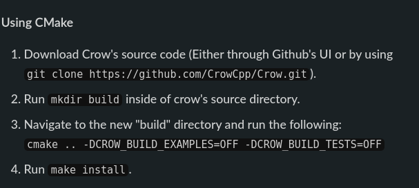

# For CROW(API C++)

# FOR MYSQL
1. In Bash:
```shell
sudo apt update
sudo apt install libmysqlcppconn-dev
```
2. In Mysql Console:
```mysql
CREATE USER 'test'@'localhost' IDENTIFIED BY 'test';
GRANT ALL PRIVILEGES ON chimie.* TO 'test'@'localhost';
CREATE DATABASE chimie;
```
# TO RUN
```shell
g++ main.cpp -o main -lmysqlcppconn
```